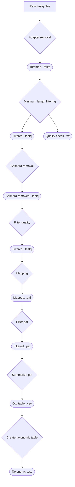

This is a modified pipeline based on the Apogee pipeline (which was modified from the Spaghetti pipeline by Latorre-Pérez et al., 2021) Apogee was authored by Kosal Khun where a new filtering script was modified by Marc-Olivier Duceppe (marc-olivier.duceppe@inspection.gc.ca).

My version modifies the minimap2 parameters to include a -f1000 flag (to ensure the minimum fragment length is 1000 bp before mapping) , and modifying the snakefile rules to include "script" instead of "shell" commands when running the fitlerPAF rule. Below is a README on how to use the pipeline and additional details.

## ABOUT
The Apogee pipeline is designed for the analysis of Nanopore sequencing data. The pipeline was modified from: 

Latorre-Pérez, A., Gimeno-Valero, H., Tanner, K., Pascual, J., Vilanova, C., & Porcar, M. (2021). A Round Trip to the Desert: In situ Nanopore Sequencing Informs Targeted Bioprospecting. Frontiers In Microbiology, 12. doi: 10.3389/fmicb.2021.768240.

The filtering step was replaced to add a filtering option based on mapping quality (mapq). 

The pipeline includes modules for quality control, adapter removal, length filtering, chimera detection, taxonomic assignment, and result summarization.

## SUMMARY  
The Apogee pipeline consists of the following steps:



## USAGE

First, load the conda environment with the required tools:
```
conda env create -f environment.yaml
```

Then copy the file config-template.yml as config.yml and customise it to suit your needs.

Finally, to run the pipeline without any parameters:

```
snakemake --cores <number_of_cores>
```

NB: You can have multiple config files (one for each set of parameters). To run a specific config file, use:
```
snakemake --cores <number_of_cores> --configfile <path_to_configfile>
```

## INPUT

You need to provide the pipeline with appropriate 16S sequencing data in FASTQ format.

The pipeline will look for fastq files in the fastq_folder, starting with fastq_prefix (see PARAMETERS):

    [FASTQ FOLDER]
        │
        └── {fastq_prefix}_*.fastq

## PARAMETERS

The pipeline parameters can be adjusted in the config.yml file. The parameters include:

|Parameter | Value
|----|-----|
|fastq_folder| Path to the folder with FASTQ files|
|fastq_prefix| Prefix of the fastq files|
|output_folder| Path to the output folder |
|mmi| Path to the minimap2 index file|
|tsv| Path to the taxonomy file|
|threads| Number of threads to use for parallel processing|
|min_read_length| Filter on a minimum read length (NanoFilt) |
|quality_score| Filter on a minimum average read quality score (NanoFilt) |
|mapping_bp| Stop chain enlongation if there are no minimizers in INT-bp (minimap2)|
|minibatch_size| Minibatch size for mapping (minimap2)|
|coverage| If coverage reach this value, region is marked as bad (yacrd)|
|not_coverage| If the ratio of bad region length on total length is lower than this value, read is marked as NotCovered (yacrd)|
|filter_paf_block_limit| Hits with a block length alingment lower than this parameter will be removed (filter_paf)|
|filter_paf_min_confidence| Minimum confidence level (summarize_paf)|


## OUTPUT
The pipeline generates various output files, including:

    [OUTPUT FOLDER]
        │
        ├── porechop
        │       └── {fastq_prefix}_*-porechop.fastq
        ├── nanofilt
        │       └── {fastq_prefix}_*-porechop-nanofilt.fastq
        │       └── {fastq_prefix}_*-porechop-nanofilt.paf (temporary files)
        ├── nanostat
        │       └── {fastq_prefix}_*-porechop-nanofilt-NanoStat.txt
        ├── yacrd
        │       ├── {fastq_prefix}_*-porechop-nanofilt.scrubb.fastq
        │       ├── {fastq_prefix}_*-porechop-nanofilt.scrubb.refilt.fastq
        │       └── {fastq_prefix}_*-porechop-nanofilt.yacrd
        ├── mapping
        │       └── {fastq_prefix}_*-porechop-nanofilt.scrubb.refilt.paf
        ├── filteredPAFs
        │       └── {fastq_prefix}_*-porechop-nanofilt.scrubb.refilt-f.paf
        └── otu_table
                ├── otu_table_{fastq_prefix}.csv
                └── phyloseq_taxonomy_{fastq_prefix}.csv


## CREDITS
The original pipeline was written by Adriel Latorre (alatorre@darwinbioprospecting.com), while the new filtering script was written by Marc-Olivier Duceppe (marc-olivier.duceppe@inspection.gc.ca).

## CONTRIBUTIONS
*Indicate whether the project is open for contributions.
If it is, indicate how to contribute.*

## CITATION
If you use this pipeline for your analysis, please cite it using the [CITATION.cff file](CITATION.cff)
